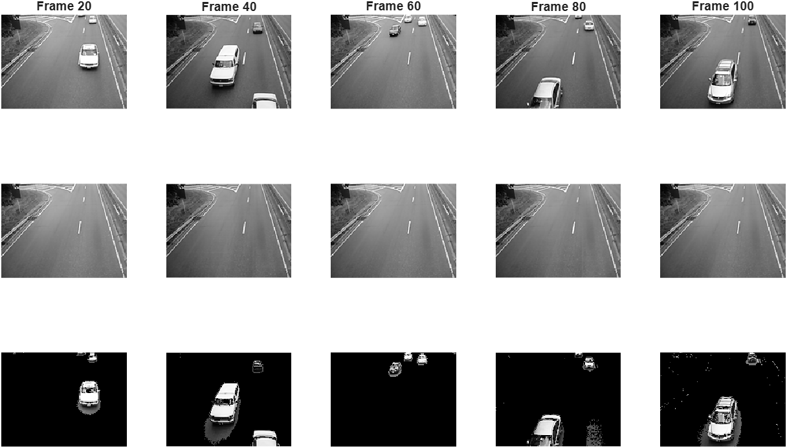

# Tensor CUR Decomposition under the Linear-Map-Based Tensor-Tensor Multiplication
<p align="center"><a href="https://arxiv.org/abs/2602.09539"></a>

This repository contains the code of the paper "Tensor CUR Decomposition under the Linear-Map-Based Tensor-Tensor Multiplication"

## Contents

* **Overview**
  
We introduce the tensor CUR decomposition under the framework of the linear-map-based tensor-tensor multiplication, and show its performance in video foreground-background separation for different linear maps.

- `Demo_MCUR.m`
  MATLAB demo script for the proposed method. It loads the bundled tensor, runs MCUR, and visualizes frames `20, 40, 60, 80, 100` in a `3 x 5` layout.
- `data/`
  Sample grayscale video tensor used by the demo:
  - `gray_carvid.mat`

## Getting Started

1. Open MATLAB.
2. Change directory to this repository.
3. Run:

```matlab
results = Demo_MCUR;
```

The demo will:

- load `gray_carvid.mat` from `data/`,
- run the proposed deterministic tensor CUR method with a DCT-based linear map,
- display frames `20, 40, 60, 80, 100` with row 1 = original, row 2 = background, row 3 = foreground,
- return a `results` struct containing the reconstructed tensors and runtime summary.

For a non-plotting run, use:

```matlab
results = Demo_MCUR('make_plots', false);
```

## Results Demo




## Notes

- The demo is self-contained.
- The bundled dataset is loaded directly from `data/`, so no path editing is required after cloning.
* **Colophon**
  - Credits -- code, algorithm, implementation/deployment, testing and overall direction: Susana Lopez Moreno, June-Ho Lee, Taehyeong Kim.
  - Copyright and License -- see [LICENSE](https://github.com/SusanaLM/LinearMapTensorCUR/blob/main/LICENSE) file.
  - How to contribute: submit issues.
  - This project has received funding from the National Research Foundation of Korea (NRF) grant funded by the Korea government (MSIT) (No. RS-2024-00406152, 2022R1A5A1033624, RS-2024-00342939, RS-2025-25436769).
  - References:  [https://arxiv.org/abs/](https://arxiv.org/abs/2602.09539)
 
* **Citation**

If you use this code for your research, please cite our paper:

```bibtex
@misc{linearmaptensorCUR,
  title={Tensor CUR Decomposition under the Linear-Map-Based Tensor-Tensor Multiplication}, 
      author={Susana Lopez-Moreno and June-Ho Lee and Taehyeong Kim},
      year={2026},
      eprint={2602.09539},
      archivePrefix={arXiv},
      url={https://arxiv.org/abs/2602.09539}, 
}
```
